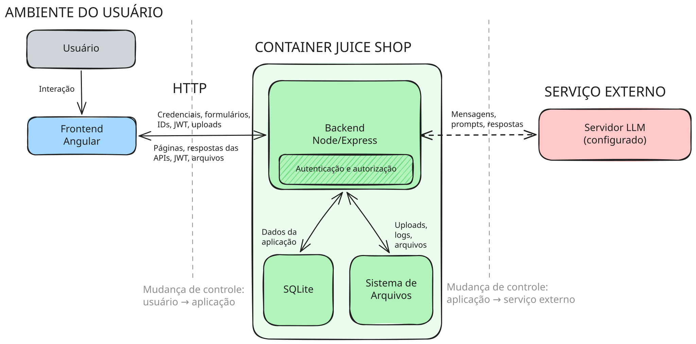

# Descoberta arquitetural

## Motivação

Este documento complementa o levantamento black-box com os principais fluxos identificados no código-fonte do Juice Shop. O objetivo é criar uma base sólida para o Threat Modeling, indicando quais dados trafegam, onde o controle muda e quais perguntas de segurança precisam ser respondidas.

> *Nesta etapa, recomenda-se o apoio de um agente de IA para acelerar a leitura do código-fonte, especialmente em aplicações extensas ou pouco conhecidas. Um prompt de apoio está disponível ao final deste documento. Todas as informações produzidas por IA devem ser validadas pelo profissional responsável.*

## Diagrama



## Fluxos e perguntas de segurança

| Fluxo | Dados | Mudança de controle? | Pergunta para o Threat Modeling | Evidência |
|---|---|---|---|---|
| Navegador → backend | Credenciais, JWT, formulários, IDs e uploads | Sim: o navegador é controlado pelo usuário | O backend valida a entrada, a identidade e a autorização? | `server.ts:596`, `server.ts:699` |
| Backend → navegador | Páginas, respostas das APIs, JWT e arquivos | Sim: os dados são entregues ao ambiente do usuário | Algum dado sensível é exposto ou apresentado sem tratamento adequado? | `server.ts:288`, `routes/login.ts:26` |
| Backend → SQLite | Contas, endereços, cartões, pedidos e outros dados da aplicação | Não no escopo atual: o SQLite é acessado pelo mesmo processo dentro do container | As operações preservam a confidencialidade e a integridade dos dados? | `models/index.ts:33` |
| Backend → sistema de arquivos | Uploads, logs e arquivos gerados | Não no escopo atual: o sistema de arquivos pertence ao mesmo container | Arquivos controlados pelo usuário são validados e acessados com segurança? | `server.ts:699` |
| Backend → servidor LLM (configurado) | Mensagens, prompts e chamadas de ferramentas | Sim: o processamento ocorre em outro serviço | Quais dados saem da aplicação e como as respostas e chamadas de ferramentas são validadas? | `routes/chat.ts:108` |
| Requisição de cliente → funções privilegiadas | Requisições autenticadas | Sim: o nível de privilégio muda | A autorização diferencia corretamente clientes, contabilidade e administradores? | `lib/insecurity.ts:142`, `server.ts:431` |

## Prompt sugerido

```text
Analise o código-fonte desta aplicação para mapear somente os principais fluxos relevantes para Threat Modeling. Leia primeiro as instruções do repositório e considere a revisão ou o commit informado como escopo da análise.

Rastreie os fluxos entre navegador, backend, armazenamentos de dados, sistema de arquivos, serviços externos e níveis de privilégio. Inclua somente fluxos que transportem autenticação, dados sensíveis ou de negócio, uploads, integrações externas ou acesso privilegiado.

Para cada fluxo, informe:
- Origem e destino;
- Dados transportados;
- Se existe mudança de controle e o motivo em uma frase;
- Uma pergunta de segurança que deverá ser respondida no Threat Modeling;
- Evidência no formato `arquivo:linha`.

Considere que há mudança de controle quando os lados pertencem a usuários, processos, serviços externos ou níveis de privilégio diferentes. Não trate chamadas entre funções internas com o mesmo privilégio como mudança de controle.

Como output, gere somente uma tabela Markdown com as colunas: `Fluxo`, `Dados`, `Mudança de controle?`, `Pergunta para o Threat Modeling` e `Evidência`. Sinalize na própria célula quando algo for inferência, desconhecido ou apenas configurado sem validação durante a execução.

Não altere arquivos, não procure vulnerabilidades e não liste endpoints, classes ou dependências individuais.
```
