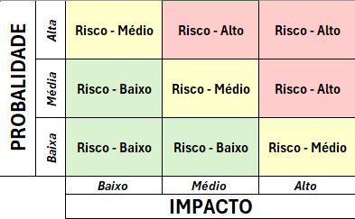
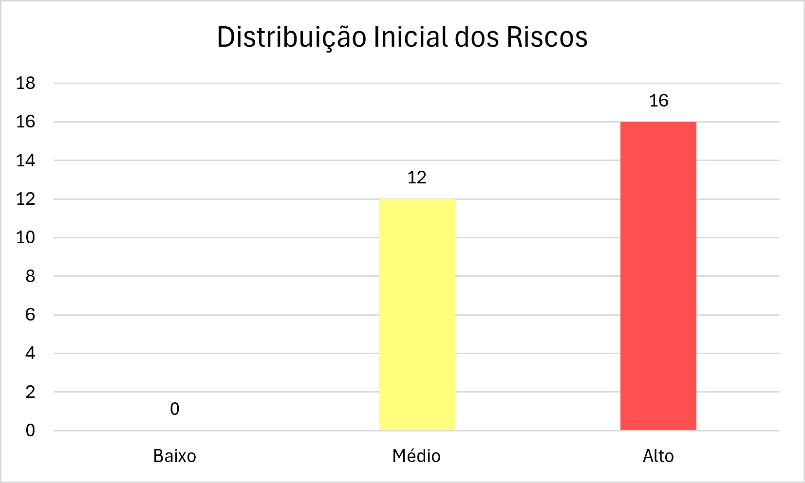

# Risk Assessment

## Motivação

De posse dos principais componentes, dados e funcionalidades, precisamos identificar o que a aplicação deve proteger e os impactos de violações de confidencialidade, integridade e disponibilidade. Após a identificação das ameaças, esses impactos serão combinados com a probabilidade de cada cenário para calcular e priorizar os riscos.

> risco = impacto × probabilidade

## Etapa 1 — Mapeamento inicial

### Ativos e impactos

| Ativo | Por que proteger? | Consequência da perda de Confidencialidade | Consequência da perda de Integridade | Consequência da perda de Disponibilidade |
|---|---|---|---|---|
| Contas e identidades dos clientes | Garantir o acesso dos clientes e a associação correta das ações realizadas no sistema. | Violação da privacidade, possibilidade de fraude contra o cliente e perda de confiança na aplicação. | Compras ou alterações indevidas em nome do cliente, prejuízo financeiro e necessidade de recuperação da conta. | Interrupção de compras e outras operações autenticadas, além do aumento de solicitações ao suporte. |
| Privilégios administrativos | Garantir que somente usuários autorizados executem ações administrativas. | Violação da privacidade dos clientes e possível impacto legal e reputacional para a organização. | Fraudes, alterações indevidas na operação da loja e perda de confiança nas informações da aplicação. | Interrupção da gestão de produtos, usuários e outras atividades administrativas. |
| Dados de pagamento | Impedir fraudes e cobranças indevidas. | Prejuízo financeiro aos clientes, contestações de pagamento e perda de confiança na aplicação. | Cobranças e saldos incorretos, perdas financeiras e aumento de disputas com clientes. | Interrupção do checkout, perda de vendas e impossibilidade de adicionar fundos à carteira. |
| Dados de endereço | Proteger os dados pessoais e garantir a entrega correta dos pedidos. | Violação da privacidade e possibilidade de uso indevido das informações pessoais do cliente. | Entregas incorretas, perda financeira, reenvio de produtos e insatisfação do cliente. | Impossibilidade de concluir pedidos ou atrasos no processo de compra. |
| Dados de produtos | Garantir que clientes consultem e comprem produtos com informações corretas. | N/A: as informações do catálogo são públicas. | Compras com valores ou informações incorretas, perda financeira e quebra de confiança na loja. | Perda de vendas e impossibilidade de consultar ou comprar produtos. |
| Dados de IP | Preservar dados pessoais e registros usados em auditorias e investigações. | Violação da privacidade e maior exposição do cliente a abordagens ou ataques direcionados. | Investigações incorretas, dificuldade para atribuir ações e perda de confiança nos registros. | Atraso na resposta a incidentes e dificuldade para atender auditorias. |
| Arquivos enviados e armazenados | Preservar as imagens e os anexos utilizados pelas funcionalidades da aplicação. | Violação da privacidade e possível exposição de informações contidas nos arquivos. | Perda de confiança nos arquivos e possível distribuição de conteúdo indevido. | Interrupção de funcionalidades que dependem de imagens ou anexos e aumento de solicitações ao suporte. |
| Pedidos e checkout | Garantir que compras sejam registradas, processadas e acompanhadas corretamente. | Violação da privacidade por meio da exposição do histórico e dos detalhes das compras. | Pedidos, valores ou status incorretos, prejuízo financeiro e disputas com clientes. | Interrupção das compras, perda de vendas e impossibilidade de acompanhar entregas. |
| Avaliações de produtos | Preservar informações usadas por clientes durante a decisão de compra. | N/A: as avaliações são publicadas para consulta dos usuários. | Decisões de compra baseadas em informações incorretas e dano à reputação da loja ou dos produtos. | Clientes deixam de consultar ou publicar avaliações, reduzindo a confiança no catálogo. |
| Exportação e exclusão de dados | Permitir o atendimento correto às solicitações de privacidade dos clientes. | Violação da privacidade, impacto legal e perda de confiança dos clientes. | Exportação incorreta, exclusão indevida de informações e descumprimento das solicitações do cliente. | Impossibilidade de atender solicitações de privacidade e aumento do impacto legal e operacional. |
| Funcionamento da aplicação | Manter a loja disponível e suas operações funcionando corretamente. | N/A: o funcionamento do serviço não contém informação confidencial por si só. | Operações e resultados incorretos, perdas financeiras e quebra de confiança na aplicação. | Interrupção do serviço, perda de vendas e impossibilidade de atender clientes. |
| Chaves e configurações de segurança | Preservar os mecanismos usados para autenticação e proteção da aplicação. | Acesso indevido a contas e dados, fraudes e violação da privacidade dos clientes. | Falha ou contorno dos controles de segurança e perda de confiança nas identidades e operações. | Interrupção da autenticação ou de outras funções que dependem dessas configurações. |

## Etapa 2 — Priorização após o Threat Modeling

Esta é uma avaliação inicial baseada nas ameaças identificadas. A probabilidade e o risco podem mudar após a validação por testes de segurança.

### Critérios

| Nível | Impacto | Probabilidade |
|---|---|---|
| Baixo | Consequência limitada. | Exige condições difíceis ou acesso elevado. |
| Médio | Consequência relevante, mas controlada. | Cenário plausível com algumas condições. |
| Alto | Consequência financeira, operacional, legal ou de privacidade grave. | Cenário acessível e com poucas barreiras. |

### Matriz de risco



### Riscos identificados

| Ameaça | Impacto | Probabilidade | Risco | Justificativa |
|---|---|---|---|---|
| S01 | Alto | Média | Alto | O login é publicamente acessível e credenciais válidas comprometidas podem ser aceitas como legítimas. O cenário depende da obtenção prévia dessas credenciais. |
| T01 | Alto | Baixa | Médio | A alteração do token pode comprometer contas e privilégios, mas seu sucesso depende de falhas na assinatura ou na validação do JWT. |
| I01 | Alto | Média | Alto | Credenciais e JWT trafegam pelo fluxo público de autenticação. A exposição depende de falhas no transporte, processamento ou armazenamento no navegador. |
| D01 | Médio | Média | Médio | O login é público e aceita tentativas automatizadas. A indisponibilidade depende de bloqueio de contas ou consumo suficiente de recursos. |
| T02 | Alto | Média | Alto | Alterações de senha, 2FA e perfil afetam diretamente o controle da conta. O cenário depende de falhas de autenticação ou autorização. |
| I02 | Alto | Média | Alto | Exportações e históricos de IP contêm dados pessoais e são acessados por identificadores ou pela sessão do cliente. O cenário depende de falhas de autorização. |
| T03 | Alto | Média | Alto | A exclusão indevida pode causar perda de dados e impacto legal. O cenário depende de falhas na validação da identidade ou da propriedade dos dados. |
| T04 | Alto | Média | Alto | Produtos, preços e avaliações influenciam compras e a confiança no catálogo. A alteração depende de controles insuficientes de autorização ou validação. |
| D02 | Médio | Média | Médio | Busca e envio de conteúdo possuem pontos de entrada públicos. A indisponibilidade depende do volume aceito e dos limites aplicados. |
| T05 | Alto | Média | Alto | Itens, quantidades e valores alterados podem gerar pedidos e cobranças incorretas. O cenário depende da validação realizada pelo backend. |
| I03 | Alto | Média | Alto | Pedidos contêm dados pessoais e comerciais associados a identificadores. O cenário depende de falhas na autorização entre clientes. |
| R01 | Médio | Média | Médio | Alterações em pedidos podem gerar disputas. A atribuição depende da existência e da qualidade dos registros da aplicação. |
| T06 | Alto | Média | Alto | A manipulação de cartões, saldo ou cobranças pode causar perdas financeiras. O cenário depende da validação das operações no backend. |
| I04 | Alto | Média | Alto | Cartões e saldos são dados financeiros acessados por funcionalidades autenticadas. O cenário depende de falhas de autorização ou exposição nas respostas. |
| R02 | Alto | Média | Alto | Recargas e pagamentos contestados podem gerar perdas financeiras. A verificação depende de registros confiáveis das transações. |
| T07 | Alto | Média | Alto | Alterações de endereço podem desviar entregas e causar prejuízo. O cenário depende de falhas na autorização entre clientes. |
| I05 | Alto | Média | Alto | Endereços são dados pessoais associados a identificadores. O cenário depende de falhas na autorização entre clientes. |
| T08 | Médio | Média | Médio | O upload aceita conteúdo controlado pelo usuário. O impacto depende dos formatos permitidos e de como o arquivo é armazenado e servido. |
| I06 | Médio | Média | Médio | Imagens, anexos e PDFs podem conter informações pessoais. O acesso depende da previsibilidade das referências e dos controles de autorização. |
| D03 | Médio | Média | Médio | Uploads repetidos podem consumir o armazenamento disponível. A indisponibilidade depende dos limites de tamanho, quantidade e capacidade do ambiente. |
| I07 | Alto | Baixa | Médio | Mensagens podem conter dados sensíveis enviados a um serviço externo. No ambiente atual, o servidor LLM está apenas configurado e não foi validado em execução. |
| T09 | Alto | Média | Alto | Entradas controladas pelo usuário podem influenciar respostas e chamadas de ferramentas. O sucesso depende das permissões e validações aplicadas pelo backend. |
| D04 | Médio | Média | Médio | O assistente pode gerar chamadas custosas ao backend ou ao servidor LLM. A indisponibilidade depende dos limites de uso e recursos disponíveis. |
| E01 | Alto | Média | Alto | Funções administrativas e de contabilidade possuem alto impacto. O acesso indevido depende de falhas na verificação de perfil pelo backend. |
| R03 | Alto | Média | Alto | Ações privilegiadas podem causar alterações graves e disputas internas. A atribuição depende de registros confiáveis e vinculados ao operador. |
| T10 | Alto | Baixa | Médio | A alteração direta da persistência afeta vários ativos, mas exige acesso ao container, banco ou sistema de arquivos. |
| I08 | Alto | Baixa | Médio | O banco e os arquivos concentram dados sensíveis, mas sua exposição direta exige acesso ao ambiente ou configuração insegura. |
| D05 | Alto | Baixa | Médio | A perda da persistência pode interromper a aplicação, mas exige acesso ao ambiente, falha operacional ou corrupção dos dados. |

### Distribuição dos riscos



## Como reproduzir esta etapa

### Etapa 1 — Mapeamento inicial

- Use os dados e funcionalidades da exploração manual.
- Relacione-os aos componentes e fluxos da descoberta arquitetural.
- Agrupe como ativos somente o que possui valor para usuários ou para a operação.
- Descreva as consequências da perda de confidencialidade, integridade e disponibilidade.
- Use `N/A` quando uma propriedade não se aplicar ao ativo.

### Etapa 2 — Priorização após o Threat Modeling

- Relacione cada ameaça ao impacto do ativo afetado.
- Estime a probabilidade considerando exposição, acesso necessário e condições do cenário.
- Use a matriz para definir o nível de risco.
- Justifique a classificação em uma ou duas frases.
- Reavalie o risco quando testes produzirem novas evidências.

## Prompt sugerido

```text
Realize o Risk Assessment desta aplicação em duas etapas.

Na etapa 1, use o levantamento manual e a descoberta arquitetural para gerar uma tabela com as colunas `Ativo`, `Por que proteger?`, `Consequência da perda de Confidencialidade`, `Consequência da perda de Integridade` e `Consequência da perda de Disponibilidade`. Agrupe itens semelhantes e use `N/A` quando uma propriedade não se aplicar.

Na etapa 2, use os IDs do Threat Model e a matriz deste documento para gerar uma tabela com as colunas `Ameaça`, `Impacto`, `Probabilidade`, `Risco` e `Justificativa`. Considere exposição, acesso necessário e condições do cenário. Limite cada justificativa a duas frases.

Não trate ameaças como vulnerabilidades comprovadas e não altere arquivos. Retorne somente as duas tabelas.
```
